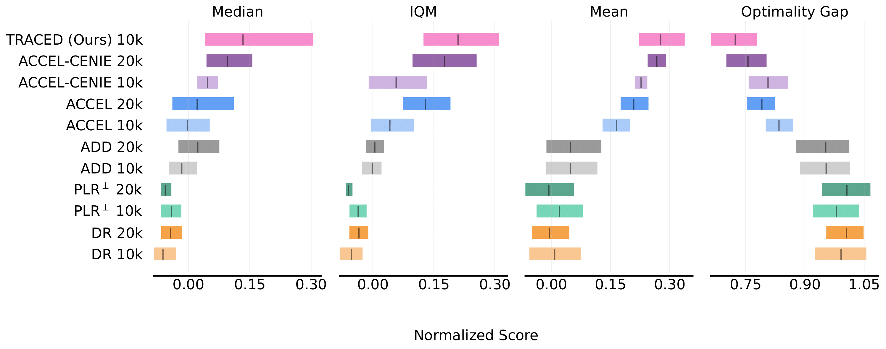
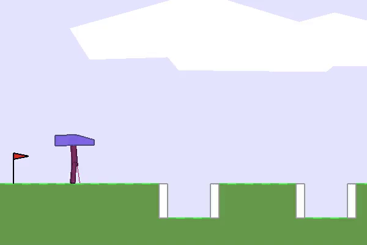
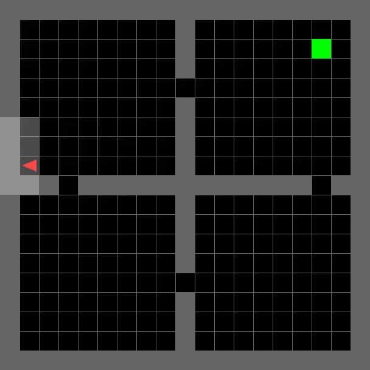
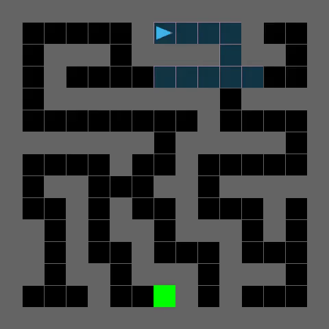
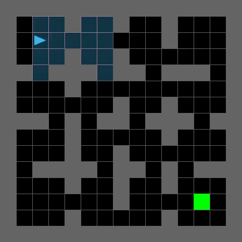
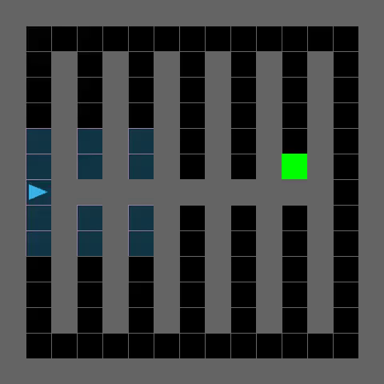
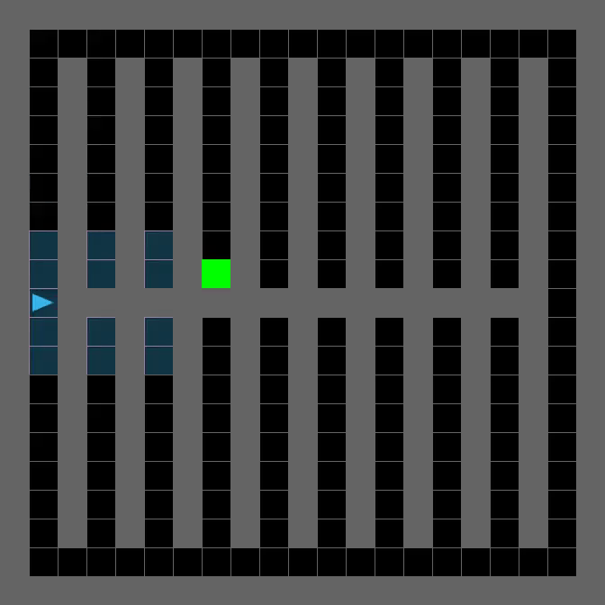

# TRACED: Transition-aware Regret Approximation with Co-Learnability for Environment Design

[](https://creativecommons.org/licenses/by-nc/4.0/)

**TRACED** (Transition-aware Regret Approximation with Co-Learnability for Environment Design) is an unsupervised environment-design algorithm that refines regret estimation by decomposing it into value and transition prediction errors, and integrates a lightweight co-learnability metric to quantify the transfer benefits between tasks. It outperforms existing methods-PLR<sup>⊥</sup>, DR, ACCEL, ADD, and CENIE-in zero-shot transfer on MiniGrid mazes and BipedalWalker.



For more information, please see our [project page](https://geonwoo.me/traced/).

## 🎥 Demonstrations

<p align="center"><b>BipedalWalker</b></p>
<table align="center">
  <tr>
    <td></td>
    <td></td>
    <td></td>
  </tr>
</table>

<p align="center"><b>MiniGrid</b></p>
<table align="center">
  <tr>
    <td></td>
    <td></td>
    <td></td>
    <td></td>
  </tr>
  <tr>
    <td></td>
    <td></td>
    <td></td>
    <td></td>
  </tr>
</table>

## 📖 Installation

Ensure you have **Conda** installed. Optionally, a **GPU** with CUDA support speeds up experiments.

```bash
conda create --name traced python=3.8
conda activate traced
pip install -r requirements.txt
git clone https://github.com/openai/baselines.git
cd baselines && pip install -e . && cd ..
pip install pyglet==1.5.11
```

> **Note**: If you see
> `AttributeError: module 'numpy' has no attribute 'bool'`
> replace instances of `np.bool` with `np.bool_`. See [NumPy 1.20 deprecations](https://numpy.org/devdocs/release/1.20.0-notes.html#deprecations).

## 🚀 Training

All of TRACED’s training logic is contained in [`train.py`](https://github.com/Cho-Geonwoo/traced/blob/main/train.py), which you can invoke directly:

```bash
python -m train {options}
```

Rather than manually specifying every flag, you can generate a full command from a JSON configuration:

```bash
python train_scripts/make_cmd.py --json {config} --num_trials 1
```

This will print `[options]` that encodes all the settings in train_scripts/grid_configs/<config_name>.json.

<details>
<summary><b>Example commands</b></summary>

```bash
# TRACED on BipedalWalker

python -m train --xpid=ued-BipedalWalker-Adversarial-Easy-v0--noexpgrad-lr0.0003-epoch5-mb32-v0.5-gc0.5-henv0.01-ha0.001-plr0.9-rho0.5-n1000-st0.5-positive_value_loss-rank-t0.1-editor1.0-random-n3-baseeasy-tl_0 --env_name=BipedalWalker-Adversarial-Easy-v0 --use_gae=True --gamma=0.99 --gae_lambda=0.9 --seed=4361 --recurrent_arch=lstm --recurrent_agent=False --recurrent_adversary_env=False --recurrent_hidden_size=1 --use_global_critic=False --lr=0.0003 --num_steps=2048 --num_processes=16 --num_env_steps=2000000000 --ppo_epoch=5 --num_mini_batch=32 --entropy_coef=0.001 --value_loss_coef=0.5 --clip_param=0.2 --clip_value_loss=False --adv_entropy_coef=0.01 --max_grad_norm=0.5 --algo=ppo --use_plr=True --level_replay_prob=0.9 --level_replay_rho=0.5 --level_replay_seed_buffer_size=1000 --level_replay_score_transform=rank --level_replay_temperature=0.1 --staleness_coef=0.5 --no_exploratory_grad_updates=True --use_editor=True --level_editor_prob=1.0 --level_editor_method=random --num_edits=3 --base_levels=easy --use_lstm=False --use_behavioural_cloning=False --kl_loss_coef=0.0 --kl_update_step=1 --use_kl_only_agent=False --log_interval=10 --screenshot_interval=200 --log_grad_norm=True --normalize_returns=True --checkpoint_basis=student_grad_updates --archive_interval=5000 --use_traced=True --colearnability_weight=0.6 --transition_prob_weight=1.5 --handle_timelimits=True --level_replay_strategy=positive_value_loss --test_env_names=BipedalWalker-v3,BipedalWalkerHardcore-v3,BipedalWalker-Med-Stairs-v0,BipedalWalker-Med-PitGap-v0,BipedalWalker-Med-StumpHeight-v0,BipedalWalker-Med-Roughness-v0 --log_dir=/data/DCD/TRACED --test_interval=100 --test_num_episodes=10 --test_num_processes=2 --log_plr_buffer_stats=True --log_replay_complexity=True --checkpoint=True --log_action_complexity=False
```

```bash
# TRACED on MiniGrid mazes

python -m train --xpid=ued-MultiGrid-GoalLastEmptyAdversarialEnv-Edit-v0--noexpgrad-lstm256a-lr0.0001-epoch5-mb1-v0.5-gc0.5-henv0.0-ha0.0-plr0.8-rho0.5-n4000-st0.3-positive_value_loss-rank-t0.3-editor1.0-random-n5-baseeasy-tl_0 --env_name=MultiGrid-GoalLastEmptyAdversarialEnv-Edit-v0 --use_gae=True --gamma=0.995 --gae_lambda=0.95 --seed=7664 --recurrent_arch=lstm --recurrent_agent=True --recurrent_adversary_env=False --recurrent_hidden_size=256 --use_global_critic=False --lr=0.0001 --num_steps=256 --num_processes=32 --num_env_steps=250000000 --ppo_epoch=5 --num_mini_batch=1 --entropy_coef=0.0 --value_loss_coef=0.5 --clip_param=0.2 --clip_value_loss=True --adv_entropy_coef=0.0 --max_grad_norm=0.5 --algo=ppo --use_plr=True --level_replay_prob=0.8 --level_replay_rho=0.5 --level_replay_seed_buffer_size=4000 --level_replay_score_transform=rank --level_replay_temperature=0.3 --staleness_coef=0.3 --no_exploratory_grad_updates=True --use_editor=True --level_editor_prob=1.0 --level_editor_method=random --num_edits=5 --base_levels=easy --use_lstm=False --use_behavioural_cloning=False --kl_loss_coef=0.0 --kl_update_step=1 --use_kl_only_agent=False --log_interval=25 --screenshot_interval=1000 --log_grad_norm=False --handle_timelimits=True --checkpoint_basis=student_grad_updates --archive_interval=5000 --use_traced=True --colearnability_weight=1.0 --transition_prob_weight=1.0 --level_replay_strategy=positive_value_loss --test_env_names=MultiGrid-SixteenRooms-v0,MiniGrid-SimpleCrossingS9N1-v0,MiniGrid-FourRooms-v0,MultiGrid-SmallCorridor-v0,MultiGrid-Labyrinth-v0,MultiGrid-Maze-v0,MultiGrid-PerfectMazeMedium-v0 --log_dir=./logs/traced --log_action_complexity=True --log_plr_buffer_stats=True --log_replay_complexity=True --reject_unsolvable_seeds=False --checkpoint=True
```

</details>

## 🔍 Evaluation

### Evaluating a single model

The following command evaluates a `<model>.tar` in an experiment results directory, `<xpid>`, in a base log output directory `<log_dir>` for `<num_episodes>` episodes in each of the environments named `<env_name1>`, `<env_name1>`, and `<env_name1>`, and outputs the results as a .csv in `<result_dir>`.

```shell
python -m eval \
--base_path <log_dir> \
--xpid <xpid> \
--model_tar <model>
--env_names <env_name1>,<env_name2>,<env_name3> \
--num_episodes <num_episodes> \
--result_path <result_dir>
```

### Evaluating multiple models

Similarly, the following command evaluates all models named `<model>.tar` in experiment results directories matching the prefix `<xpid_prefix>`. This prefix argument is useful for evaluating models from a set of training runs with the same hyperparameter settings. The resulting .csv will contain a column for each model matched and evaluated this way.

```shell
python -m eval \
--base_path <log_dir> \
--prefix <xpid_prefix> \
--model_tar <model> \
--env_names <env_name1>,<env_name2>,<env_name3> \
--num_episodes <num_episodes> \
--accumulator mean \
--result_path <result_dir>
```

### Evaluating on zero-shot benchmarks

Replacing the `--env_names=...` argument with the `--benchmark=<benchmark>` argument will perform evaluation over a set of benchmark test environments for the domain specified by `<benchmark>`. The various zero-shot benchmarks are described below:
| `benchmark` | Description |
| ------------- |:-------------|
| `maze` | Human-designed mazes, including singleton and procedurally-generated designs. |
| `bipedal` | `BipedalWalker-v3`, `BipedalWalkerHardcore-v3`, and isolated challenges for stairs, stumps, pit gaps, and ground roughness. |

## 🌐 Environments & Baselines

### 🧭 MiniGrid Mazes

The [MiniGrid-based mazes](https://github.com/facebookresearch/dcd/tree/master/envs/multigrid) from [Dennis et al, 2020](https://arxiv.org/abs/2012.02096) and [Jiang et al, 2021](https://arxiv.org/abs/2110.02439) require agents to perform partially-observable navigation. Various human-designed singleton and procedurally-generated mazes allow testing of zero-shot transfer performance to out-of-distribution configurations.

#### Experiments from [Jiang et al, 2021](https://arxiv.org/abs/2110.02439)

| Method          | json config                                 |
| --------------- | :------------------------------------------ |
| PLR<sup>⊥</sup> | `minigrid/25_blocks/mg_25b_robust_plr.json` |
| PLR             | `minigrid/25_blocks/mg_25b_plr.json`        |
| DR              | `minigrid/25_blocks/mg_25b_dr.json`         |

#### Experiments from [Parker-Holder et al, 2022](https://accelagent.github.io/)

| Method                                 | json config                                              |
| -------------------------------------- | :------------------------------------------------------- |
| TRACED                                 | `minigrid/60_blocks_uniform/mg_60b_uni_traced.json`      |
| ACCEL (from empty)                     | `minigrid/60_blocks_uniform/mg_60b_uni_accel_empty.json` |
| PLR<sup>⊥</sup> (Uniform(0-60) blocks) | `minigrid/mg_60b_uni_robust_plr.json`                    |
| DR (Uniform(0-60) blocks)              | `minigrid/mg_60b_uni_dr.json`                            |

### 🦿🦿 BipedalWalker

The [BipedalWalker environment](https://github.com/facebookresearch/dcd/tree/master/envs/bipedalwalker) requires continuous control of a 2D bipedal robot over challenging terrain with various obstacles, using a propriocetive observation. The zero-shot transfer configurations, used in [Parker-Holder et al, 2022](https://accelagent.github.io/), include `BipedalWalkerHardcore`, environments featuring each challenge (i.e. ground roughness, stump, pit gap, and stairs) in isolation, as well as extremely challenging configurations discovered by POET in [Wang et al, 2019](https://arxiv.org/abs/1901.01753).

| Method          | json config                       |
| --------------- | :-------------------------------- |
| TRACED          | `bipedal/bipedal_traced.json`     |
| ACCEL           | `bipedal/bipedal_accel.json`      |
| PLR<sup>⊥</sup> | `bipedal/bipedal_robust_plr.json` |
| DR              | `bipedal/bipedal_dr.json`         |

### Current environment support

| Method          | 🧭 MiniGrid mazes | 🦿🦿 BipedalWalker |
| --------------- | :---------------- | :----------------- |
| TRACED          | ✅                | ✅                 |
| ACCEL           | ✅                | ✅                 |
| PLR<sup>⊥</sup> | ✅                | ✅                 |
| PLR             | ✅                | ✅                 |
| DR              | ✅                | ✅                 |

## 📊 Monitoring

By default, [`train.py`](https://github.com/Cho-Geonwoo/traced/blob/main/train.py) generates a folder in the directory specified by the `--log_dir` argument, named according to `--xpid`. This folder contains the main training logs, `logs.csv`, and periodic screenshots of generated levels in the directory `screenshots`. Each screenshot uses the naming convention `update_<number of PPO updates>.png`. When ACCEL is turned on, the screenshot naming convention also includes information about whether the level was replayed via PLR and the mutation generation number for the level, i.e. how many mutation cycles led to this level.

For logging with Weights & Biases (wandb), you can enable logging by passing `--use_wandb true` and `--wandb_key <your_wandb_key>` as command-line arguments.

## 💾 Checkpoints

**Latest checkpoint**
The latest model checkpoint is saved as `model.tar`. The model is checkpointed every `--checkpoint_interval` number of updates. When setting `--checkpoint_basis=num_updates` (default), the checkpoint interval corresponds to number of rollout cycles (which includes one rollout for each student and teacher). Otherwise, when `--checkpoint_basis=student_grad_updates`, the checkpoint interval corresponds to the number of PPO updates performed by the student agent only. This latter checkpoint basis allows comparing methods based on number of gradient updates actually performed by the student agent, which can differ from number of rollout cycles, as methods based on Robust PLR, like ACCEL, do not perform student gradient updates every rollout cycle.

**Archived checkpoints**
Separate archived model checkpoints can be saved at specific intervals by specifying a positive value for the argument `--archive_interval`. For example, setting `--archive_interval=1250` and `--checkpoint_basis=student_grad_updates` will result in saving model checkpoints named `model_1250.tar`, `model_2500.tar`, and so on. These archived models are saved in addition to `model.tar`, which always stores the latest checkpoint, based on `--checkpoint_interval`.

## 🤝 Acknowledgements

Built on top of the Dual Curriculum Design (DCD) codebase. We thank the authors of:

- [DCD (Facebook Research)](https://github.com/facebookresearch/dcd)
- [OpenAI Baselines](https://github.com/openai/baselines)

## Misc

- Please note that this codebase may not exactly reproduce the results reported in the paper due to potential human errors during code migration. If you observe any discrepancies in performance, feel free to reach out-we’d appreciate your feedback.

* To reproduce the results for ADD ([Adversarial Environment Design via Regret-Guided Diffusion Models](https://arxiv.org/abs/2410.19715)), please see the [official ADD codebase](https://github.com/rllab-snu/ADD/tree/main).

## 📄 License

This project is licensed under **CC BY-NC 4.0**. Note that the repository relies on third-party libraries subject to their respective licenses.
